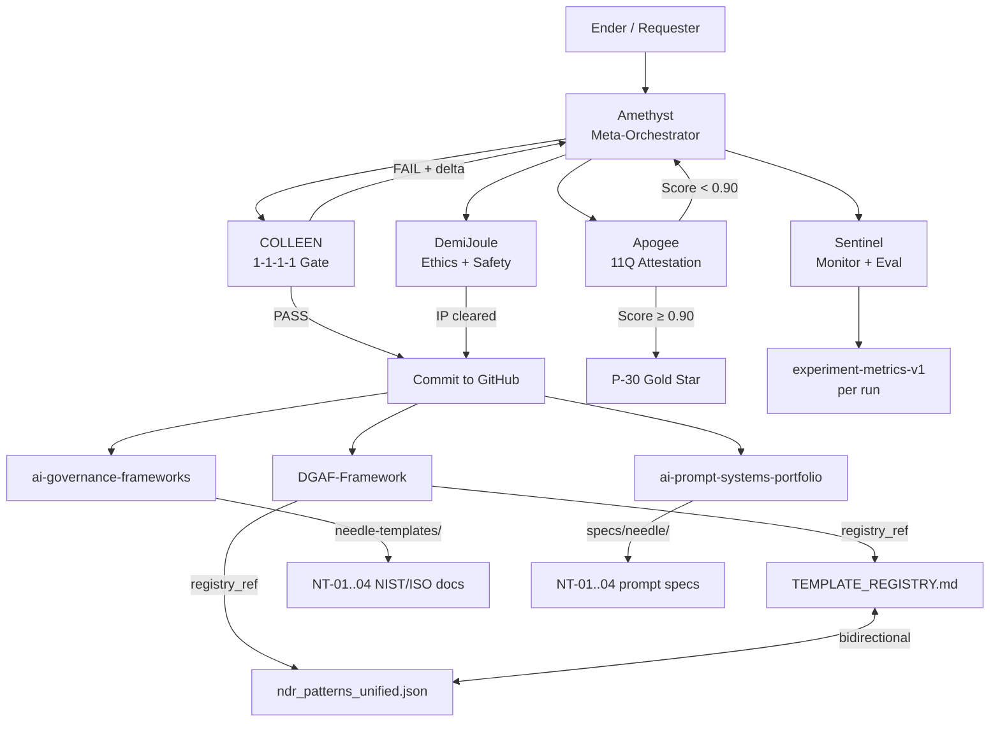

# DGAF Workspace Bootstrap
<!-- Status: ACTIVE | Session: S069 | Last Updated: 2026-06-09 | Owner: ndrorchestration -->
<!-- Agents: Amethyst (orchestrator) + COLLEEN (institutional anchor) joint authorship -->

## Purpose

This document declares the active R&D state of the DGAF ecosystem as of session
S069. It serves as the entry point for any agent or collaborator onboarding to
the workspace, defining the current sprint, active agent assignments, and
governance anchors in effect.

---

## Ecosystem State (S069)

| Layer | Component | Status | Location |
|---|---|---|---|
| Governance spine | TEMPLATE_REGISTRY.md | ✅ ACTIVE | [docs/needle/TEMPLATE_REGISTRY.md](docs/needle/TEMPLATE_REGISTRY.md) |
| Machine layer | ndr_patterns_unified.json | ✅ ACTIVE (needle_template injected) | [docs/ndr_patterns_unified.json](docs/ndr_patterns_unified.json) |
| Public governance layer | ai-governance-frameworks/docs/needle-templates/ | ✅ ACTIVE | [external repo](https://github.com/ndrorchestration/ai-governance-frameworks/tree/main/docs/needle-templates) |
| Prompt engineering layer | ai-prompt-systems-portfolio/specs/needle/ | ✅ ACTIVE | [external repo](https://github.com/ndrorchestration/ai-prompt-systems-portfolio/tree/main/specs/needle) |
| Agent registry | canonical-agent-registry.md | ✅ ACTIVE | [docs/agents/canonical-agent-registry.md](docs/agents/canonical-agent-registry.md) |
| COLLEEN protocol | colleen-l5-governance-protocol.md | ✅ ACTIVE | [docs/agents/colleen-l5-governance-protocol.md](docs/agents/colleen-l5-governance-protocol.md) |

---

## Active Agent Assignments

| Agent | Role | Active Mandate (S069) |
|---|---|---|
| **Amethyst** | Meta-orchestrator, planner | T-01–T-05 execution complete; next: Needle URL verification + Apogee attestation run |
| **COLLEEN** | Institutional anchor, 1-1-1-1 gate | All T-0x commits audited and cleared; monitoring T-05 visual artifact compliance |
| **Apogee** | QA orchestration, attestation | 11Q attestation scoring pending for all NT-xx entries post-commit |
| **Herald** | Communication bridge | State sync between Amethyst and COLLEEN across Aurora/Yggdrasil substrates |
| **DemiJoule** | Ethics + safety supervisor | IP gate cleared for T-03 (public repo); standing monitor |
| **Sentinel** | Security + eval monitor | Instrument Needle template runs with experiment-metrics-v1 schema |

---

## Sprint Goals (S069 → S070)

1. **Needle URL verification** — confirm all NT-xx Needle template URLs are stable and live; update TEMPLATE_REGISTRY.md if slugs differ
2. **Apogee attestation run** — execute 11Q scoring (P-11) across NT-01..04; produce APOGEE_11Q_NT-xx.json records in docs/qa/
3. **README backlinks** — add `## Needle Templates` section to ai-governance-frameworks README and ai-prompt-systems-portfolio README pointing back to DGAF canonical registry
4. **Experiment instrumentation** — wire experiment-metrics-v1 schema (from Amethyst planner spec) to Sentinel; baseline: experiments_per_week, manual_coordination_minutes, error_rate
5. **P-30 Gold Star gate** — once Apogee attestation and Needle URL verification complete, COLLEEN ratifies TEMPLATE_REGISTRY.md as Gold Star Certified

---

## Orchestration Flow (Current)

---

## Governance Anchors in Effect

| Anchor | Value |
|---|---|
| DGAF policy version | dgaf-v0.3.1 |
| COLLEEN audit status | CONDITIONAL_PASS_ENDER_RATIFIED (stasis block P-12–P-26) |
| Needle template registry status | ACTIVE — 4 templates, P-30 attestation pending |
| NDR pattern watermark | P-35 |
| Active session | S069 |
| Next session target | S070 — Apogee attestation + Needle URL verification |

---

## COLLEEN 1-1-1-1 Compliance (S069)

| Dimension | Status | Note |
|---|---|---|
| Semantic | ✅ PASS | All file lineages traceable: Drive → GitHub, DGAF ↔ ai-governance-frameworks ↔ ai-prompt-systems-portfolio |
| Logical | ✅ PASS | P-05 → P-11 sequential confirmed; no circular deps in NDR pattern graph |
| Visual | ✅ PASS | Mermaid orchestration flow present in this document |
| Ethical/IP | ✅ PASS | No phi constants, freq tables, or personal docs in any public repo commit |

---

## Related Files

- [NDR Pattern Registry (Unified)](NDR_PATTERN_REGISTRY_UNIFIED.md)
- [NDR Patterns JSON](ndr_patterns_unified.json)
- [Needle Template Registry](needle/TEMPLATE_REGISTRY.md)
- [Agent Roster](agents/AGENT_ROSTER.md)
- [COLLEEN L5 Protocol](agents/colleen-l5-governance-protocol.md)
- [Ecosystem Inventory](ECOSYSTEM_INVENTORY.md)
